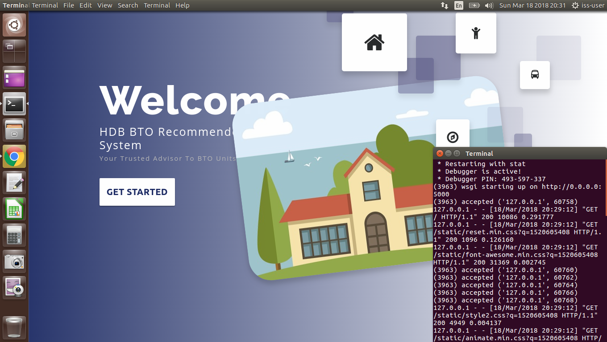

---

## SECTION 1 : Easy Shopping
## Singapore Housing & Deveoplment Board - BTO Recommender System

---

## SECTION 2 : EXECUTIVE SUMMARY / PAPER ABSTRACT

---

## SECTION 3 : CREDITS / PROJECT CONTRIBUTION

| Official Full Name  | Student ID (MTech Applicable)  | Work Items (Who Did What) | Email (Optional) |
| :------------ |:---------------:| :-----| :-----|
| Desmond Chua | A1234567A | xxxxxxxxxx yyyyyyyyyy zzzzzzzzzz| A1234567A@nus.edu.sg |
| Chang Ye Han | A1234567B | xxxxxxxxxx yyyyyyyyyy zzzzzzzzzz| A1234567B@gmail.com |
| Chee Jia Wei | A1234567C | xxxxxxxxxx yyyyyyyyyy zzzzzzzzzz| A1234567C@outlook.com |
| Ganesh Kumar | A1234567D | xxxxxxxxxx yyyyyyyyyy zzzzzzzzzz| A1234567D@yahoo.com |
| Jeanette Lim | A1234567E | xxxxxxxxxx yyyyyyyyyy zzzzzzzzzz| A1234567E@qq.com |

---

## SECTION 4 : VIDEO OF SYSTEM MODELLING & USE CASE DEMO

Note: It is not mandatory for every project member to appear in video presentation; Presentation by one project member is acceptable. 
More reference video presentations [here](https://telescopeuser.wordpress.com/2018/03/31/master-of-technology-solution-know-how-video-index-2/ "video presentations")

---

## SECTION 5 : USER GUIDE

`Refer to appendix <Installation & User Guide> in project report at Github Folder: ProjectReport`

### [ 1 ] To run the system using iss-vm

> download pre-built virtual machine from http://bit.ly/iss-vm

> start iss-vm

> open terminal in iss-vm

> $ git clone https://github.com/telescopeuser/Workshop-Project-Submission-Template.git

> $ source activate iss-env-py2

> (iss-env-py2) $ cd Workshop-Project-Submission-Template/SystemCode/clips

> (iss-env-py2) $ python app.py

> **Go to URL using web browser** http://0.0.0.0:5000 or http://127.0.0.1:5000

### [ 2 ] To run the system in other/local machine:
### Install additional necessary libraries. This application works in python 2 only.

> $ sudo apt-get install python-clips clips build-essential libssl-dev libffi-dev python-dev python-pip

> $ pip install pyclips flask flask-socketio eventlet simplejson pandas

---
## SECTION 6 : MISCELLANEOUS

`Refer to Github Folder: Miscellaneous`

### HDB_BTO_SURVEY.xlsx
* Results of survey
* Insights derived, which were subsequently used in our system

---

### <<<<<<<<<<<<<<<<<<<< End of Template >>>>>>>>>>>>>>>>>>>>

---

**This [Machine Reasoning (MR)](https://www.iss.nus.edu.sg/executive-education/course/detail/machine-reasoning "Machine Reasoning") course is part of the Analytics and Intelligent Systems and Graduate Certificate in [Intelligent Reasoning Systems (IRS)](https://www.iss.nus.edu.sg/stackable-certificate-programmes/intelligent-systems "Intelligent Reasoning Systems") series offered by [NUS-ISS](https://www.iss.nus.edu.sg "Institute of Systems Science, National University of Singapore").**

**Lecturer: [GU Zhan (Sam)](https://www.iss.nus.edu.sg/about-us/staff/detail/201/GU%20Zhan "GU Zhan (Sam)")**

**zhan.gu@nus.edu.sg**
